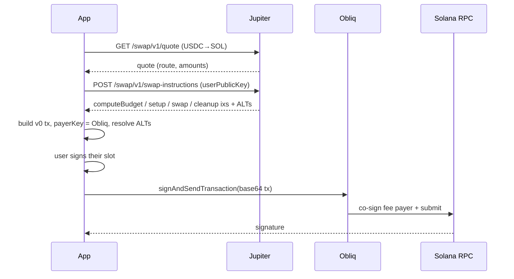

# Example: Gasless Jupiter Swap (USDC → SOL)

Swap USDC for SOL through **Jupiter**, with the **Obliq paymaster** paying the
network fee. The user signs the swap authority; Obliq co-signs the fee-payer slot.

> **Mainnet only.** Jupiter aggregates real DEX liquidity, which exists on
> **mainnet**. The `quote` command is read-only and works anywhere; `swap` refuses
> to run off mainnet unless you set `ALLOW_NON_MAINNET=true`.

## Why this needs `/swap-instructions`, not `/swap`

Jupiter's `POST /swap/v1/swap` returns a ready-made transaction whose **fee payer
is the user**. We cannot change that. So instead we call
`POST /swap/v1/swap-instructions`, which returns the raw instructions, and we
assemble **our own** transaction whose fee payer is the Obliq account.



## Steps explained

| Jupiter call | What it returns | We use |
|--------------|-----------------|--------|
| `GET /swap/v1/quote` | `inAmount`, `outAmount`, `routePlan`, `priceImpactPct` | the route + amounts |
| `POST /swap/v1/swap-instructions` | `computeBudgetInstructions[]`, `setupInstructions[]`, `swapInstruction`, `cleanupInstruction`, `addressLookupTableAddresses[]` | assemble our tx |

Each instruction is `{ programId, accounts: [{pubkey,isSigner,isWritable}], data(base64) }`;
`toInstruction()` converts it to a web3.js `TransactionInstruction`. The ALTs are
fetched with `connection.getAddressLookupTable` and passed to
`compileToV0Message(lookupTables)` so the versioned transaction stays small.

> **Compute budget.** `withCuHeadroom()` re-encodes Jupiter's
> `SetComputeUnitLimit` with a flat +60k margin. Jupiter sizes that limit to *its
> own* simulated transaction — ~29k CU for a single hop — leaving no room for
> execution drift, or for the guard instruction a wallet appends at signing.
> **If you port this file to a browser wallet, keep that margin**: Phantom and
> friends inject a Lighthouse guard that runs last, on leftover compute, and
> starving it fails the whole transaction with `Program failed to complete` on
> the trailing instruction. Because leftover slack varies with trade size, it
> misreads as a minimum-trade-size rule. Use a flat margin, not a multiplier —
> the sponsor pays priority fee on the limit.

## What this costs you

This runs on **Solana mainnet and moves real funds**. With the defaults:

| | |
|---|---|
| You spend | **1 USDC** (lower `AMOUNT_USDC` to `0.1` first) |
| You need in SOL | **nothing at all** — that is the entire point |
| OBLIQ pays | the network fee, plus ~0.0019 SOL of rent if you have never held the output token |

## Setup & run

You need an OBLIQ API key. There is no self-service signup — tenants are provisioned by
a human, and your tenant arrives already configured for this example. See
[Request access](https://xyra-labs.mintlify.site/guides/onboarding/request-access); we
reply with a tenant id, an API key and your fee-payer address.

```bash
cp .env.example .env
```

Then fill in two values:

| | |
|---|---|
| `OBLIQ_API_KEY` | the key we issued you |
| `USER_WALLET_SECRET_KEY` | **your own** wallet's base58 secret key — a throwaway, holding a little USDC and no SOL |

Those are different things and are easy to confuse. The API key authenticates you to
OBLIQ. The wallet key signs the swap and never leaves your machine — we never see it.

Fund your fee payer with a little SOL first (the dashboard's Gas screen), or nothing will
be sponsored.

```bash
npm install
npm run quote      # SAFE: prints a live quote, sends nothing
npm start          # the gasless swap — spends real USDC on mainnet
```

<details>
<summary>Running against a local paymaster instead</summary>

`npm run register` and `npm run setup` mint and configure a tenant against a **local**
OBLIQ. They call operator-only endpoints, so they cannot work against production — use
the access flow above for that.
</details>

### `.env`

| Variable | Default | Notes |
|----------|---------|-------|
| `JUPITER_BASE_URL` | `https://lite-api.jup.ag` | Free tier. Use `https://api.jup.ag` + `JUPITER_API_KEY` for higher limits |
| `INPUT_MINT` | USDC | `EPjFW…Dt1v` |
| `OUTPUT_MINT` | wSOL | `So111…1112` (unwrapped to native SOL by `wrapAndUnwrapSol`) |
| `AMOUNT_USDC` | `1.0` | Start tiny on mainnet |
| `SLIPPAGE_BPS` | `50` | 0.5% |
| `USER_WALLET_SECRET_KEY` | _(required)_ | Must hold USDC |
| `ALLOW_NON_MAINNET` | `false` | Override the mainnet guard (will likely fail — no routes) |

### Expected output (`quote`)

```
Quote: 1 USDC -> ~0.0064 SOL
  price impact: 0.01%   slippage: 50 bps
  route: Whirlpool -> Meteora DLMM
  (read-only — no transaction was sent)
```

### Expected output (`swap`)

```
User: Usr7bd...k2P (0.02 SOL, 25 USDC)
Routing 1 USDC -> ~0.0064 SOL
✔ Sponsored signature: 3Qd...m1L
✔ Network fee paid by Obliq: 5000 lamports (fee payer Fee1xq...9aV)
✔ User USDC delta: -1
✔ User SOL delta:  +0.0064  (received SOL; paid 0 network fee)
→ Explorer: https://explorer.solana.com/tx/3Qd...m1L
```

## The fee-payer program allowlist

A Jupiter swap names only a handful of programs **at the top level** (the DEXs are
reached by CPI inside Jupiter). `npm run setup` allows exactly those:

```
System · ComputeBudget · Token · Token-2022 · AssociatedToken · Jupiter v6
```

If the relayer rejects with `Kora` (a disallowed program), Jupiter changed the
top-level program set — add the reported program id to `SWAP_PROGRAMS` and re-run
`setup`. Keep `restrictIntermediateTokens=true` to bound the route.

## A note on rent and "fully gasless"

Obliq sponsors the **network fee** (the headline gasless property). For USDC → SOL
with `wrapAndUnwrapSol: true`, Jupiter creates a temporary wSOL account and closes
it within the same transaction, so the wSOL rent is **borrowed and returned** — net
~0. If you swap into a brand-new SPL token account that is *not* closed, the rent
for that account is funded per Jupiter's setup instruction (it names the user). To
sponsor that rent too, pre-create the destination ATA in a separate sponsored
transaction (see the USDC example's idempotent-ATA pattern), or run the swap for a
user who already holds the destination token account.

## Production

Use `https://api.jup.ag` with a `JUPITER_API_KEY`, a paid mainnet RPC, and your
hosted Obliq endpoint. See [Go live](https://xyra-labs.mintlify.site/guides/operate/go-live)
and [Integration architecture](https://xyra-labs.mintlify.site/guides/integrate/architecture).
